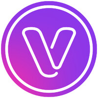

# 👋 Hello World — I’m Erik Henrique
### Senior Frontend Engineer • Scalable Architecture · AI-Driven Development · Developer Experience

I’m a **Senior Frontend Engineer** who approaches software as a craft that grows through **clarity, empathy, and shared learning**.
My focus is on **scalable architecture** and **developer experience** — building codebases that are fast, reliable, and easy for teams to evolve together.
I believe great engineering culture starts with **trust and curiosity**: encouraging people to explore, automate, and use **AI-powered tools** to amplify creativity, quality, and collaboration.

## 🧠 Core Skillset & Technologies

---

### 🚀 **Highlights**

- 🧠 **Mentored engineers** onboarding to complex Angular / Nx monorepos — introducing architecture blueprints, reactive-state patterns, and test strategies that accelerated onboarding and delivery.
- 🤖 **Pioneered AI-assisted development culture** — built internal prompt libraries for GitHub Copilot, ChatGPT, and Cursor to automate unit-test generation, PR reviews, and documentation.
- 💬 **Led cross-brand technical meetings** with distributed teams and third-party API providers, aligning architecture decisions and standards across platforms.
- 🧩 **Refactored legacy modules** into reusable, brand-agnostic Angular libraries with OnPush change detection and immutability, reducing bundle size and improving runtime stability.
- ⚡ **Championed developer-experience automation** — introduced AI prompt systems, code-review templates, and quality gates that improved test coverage and team velocity.

---

## 📊 GitHub Insights & Contributions

---

## ✍️ Latest Blog Posts
<!-- BLOG-POST-LIST:START -->
<!-- BLOG-POST-LIST:END -->
 

---

## 🧩 Work Experience

**Senior Software Engineer** \
[**Betsson Group**](https://www.betssongroup.com/) • Full-time • Malta (Hybrid) \
**Technologies**: `Angular v18`, `TypeScript`, `RxJS`, `NgRx`, `Nx`, `Jest`, `Playwright` \
**Projects**: Multi-brand cashier platform delivering secure and localized payment flows across multiple countries and brands.

**Frontend Developer** \
[**Canon Medical Systems (Brazil)**](https://br.medical.canon/) • Contract \
**Technologies**: `Angular v14–v18`, `TypeScript`, `RxJS`, `NgRx`, `Nx` \
**Projects**: Internal enterprise apps with performance and test automation focus.

**Software Engineer** \
[**Grupo SBF (Nike & Centauro)**](https://ri.gruposbf.com.br/) • Full-time \
**Technologies**: `React v18`, `Next.js`, `TypeScript`, `Styled Components`, `Jest` \
**Projects**: [Nike](https://www.nike.com.br/) and [Centauro](https://www.centauro.com.br/) — UI optimization and Core Web Vitals improvements.

**Frontend Developer** \
[**Encora Inc. (VMware Pathfinder)**](https://www.encora.com/) • Full-time \
**Technologies**: `Angular v8–v12`, `TypeScript`, `SCSS`, `Karma`, `Jasmine` \
**Projects**: [VMware Pathfinder](https://pathfinder.vmware.com/) — global EdTech platform improving accessibility and performance.

**Frontend Developer** \
[**Zup Innovation (Itaú Bank)**](https://www.zup.com.br/) • Full-time \
**Technologies**: `Angular v11`, `TypeScript`, `Node.js`, `SCSS`, `AWS (CI/CD)` \
**Projects**: Internal banking tools with CI/CD automation and scalable architecture.

**Full Stack Developer (MEAN Stack)** \
[**Venturus**](https://www.venturus.org.br/) • Full-time \
**Technologies**: `Angular v4–11`, `Node.js`, `Express.js`, `MongoDB`, `PostgreSQL` \
**Projects**: [CGO (Comex)](http://www.cgoassessoria.com.br/) and [CCR Autoban](https://www.autoban.com.br/) — B2B dashboards and automation systems.

**Full Stack Developer** \
[**MB Labs**](https://mblabs.com.br/) • Contract \
**Technologies**: `Angular/Ionic v3`, `Node.js`, `Express.js`, `REST APIs`, `PWA` \
**Projects**: Educational and publishing platforms for SM Edições and Hondana.

---

## 🤝 Let’s Connect

